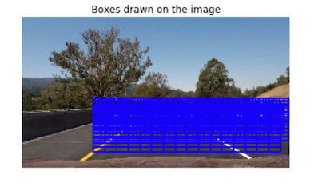
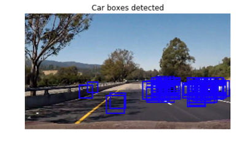
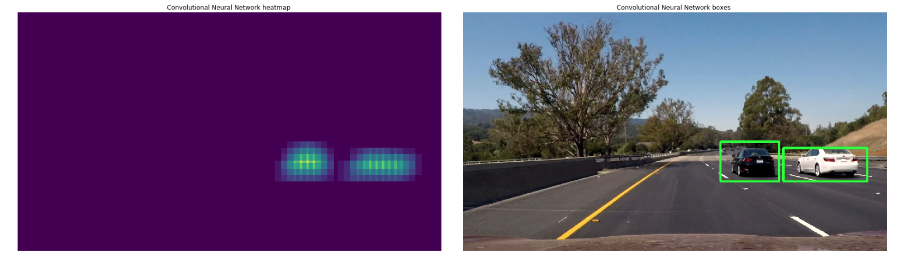
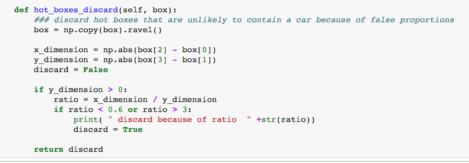
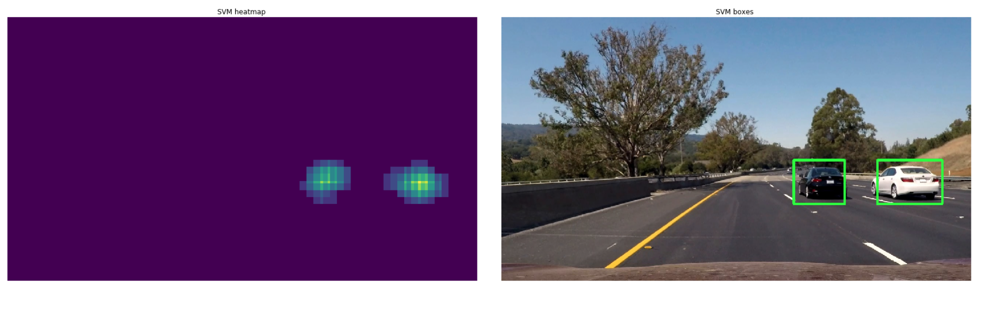
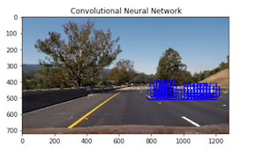
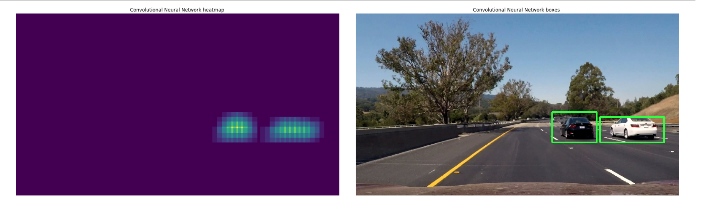
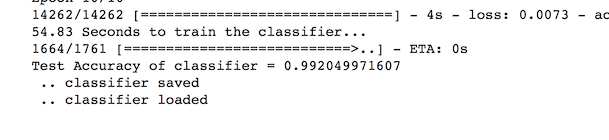
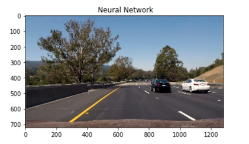
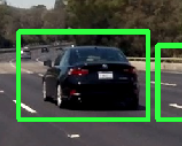

**Vehicle Detection Project**
-----------------------------

The goals / steps of this project are the following:

-   Perform a Histogram of Oriented Gradients (HOG) feature extraction on a
    labeled training set of images and train a classifier Linear SVM classifier

-   Optionally, you can also apply a color transform and append binned color
    features, as well as histograms of color, to your HOG feature vector.

-   Note: for those first two steps don't forget to normalize your features and
    randomize a selection for training and testing.

-   Implement a sliding-window technique and use your trained classifier to
    search for vehicles in images.

-   Run your pipeline on a video stream (start with the test_video.mp4 and later
    implement on full project_video.mp4) and create a heat map of recurring
    detections frame by frame to reject outliers and follow detected vehicles.

-   Estimate a bounding box for vehicles detected.

 

### **Output Video:**

**Here's a link to my video result ./project_video_output.mp4**

 

### **My implementation**

I used three different methodology in order to recognize the cars in the images.

 

1 - **Support Vector Machine**

As in the project lessons, I used a combinations of HOG features, Colors
histograms , and binned color features.

Then with a LinearSVC Support Vector machine, I have trained the classifier. The
classifier precision is on the paper 98% but  when used on real “sliding
windows” , **there are lot of false positives** .

 

Keep in mind that the train images has not been augmented, and they contain the
entire object, while in the video using sliding windows, we are getting often
cropped parts of cars.

For example the yellow line  on the asphalt sometimes get recognize as “car"

 

2 -  **Neural Network**

As before for the feature recognition, but for the classifier I have used a
Neural Network.

The performance in this case is very good , there are not false positive, **but
the classifier precision is not as good as the Support Vector Machine**

 

3 - Convolutional Neural Network

The feature extraction is done in this case but the Network itself.

**Its much faster on the prediction , but obiously is very slow to train .**

The data are augmented with the Keras Image Processing library, using shifts,
zooms, and this meant that this network is **much better  **at recognizing parts
of car , and not only the entire car** as a car.**

 

### Sliding windows.

Now, having a classifier that tells if in a portion of image there is or not a
car, we need do slide windows of **different dimensions ** on the image:

 

Having these list of windows, for each one i am applying the classifier to
recognize if the windows contains of not a part of a car

 

I recorded the positions of positive detections in each frame of the video. From
the positive detections I created a heatmap and then thresholded that map to
identify vehicle positions. I then used `scipy.ndimage.measurements.label()` to
identify individual blobs in the heatmap. I then assumed each blob corresponded
to a vehicle. I constructed bounding boxes to cover the area of each blob
detected.

### Some example here

### **FALSE POSITIVES**

I have implemented two further techniques:

1 - the averaging on the 3- previous frames, and discard of the boxes that are
**“ too much different"**

 

2 - calculating the proportions of the width/height and discard all the boxes
that are not likely to contain a car

 

### **Comparison between the 3 different classifier:**

**Support Vector Machine**

Lot of false positive

But excluding the false positive the right boxes **are well centered:**

 

**Convolutional Neural Network**

In the Conv Net there are no false positive, but the centering is not the best:

**Neural Network**

This network is the worse.

On the paper the accuracy is good, BUT ONLY ON THE PAPER:

Mainly because it has overfitted the trainin set, and now is able to recognize
only window containing the entire car, and not able to recognize part of the
car.** One solution can be to augment the training set, introducing shifs. zoom,
little rotations, and so on...but I haven’t done it**

### Discussion

#### 1. Briefly discuss any problems / issues you faced in your implementation of this project. Where will your pipeline likely fail? What could you do to make it more robust?

 

I have experimented different classifier.

I have expected the CNN to be the best, but sometimes happens something like
this:

While is quite good but it **is not perfect.**

One thing to note is that the **Convolutional Neural Network **is able to say “
its a car” , **having a cropped image window with only some parts of the car**.

But this gives too many boxes recognized as correct around the car, and the
heatmap is making a box a little bit **too bigger**

I have experimented different thresholds in the heatmap, and I have ended
calculating the average of the non-zero elements , and moltiplying this result
for 0.7
