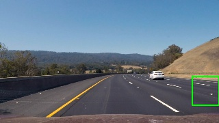
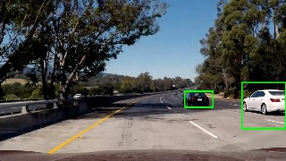
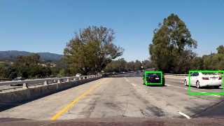
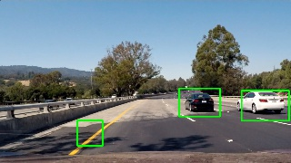

**Vehicle Detection Project**
-----------------------------

 

### **Project highlights**

-   **Histogram of Oriented Gradients (HOG)** feature extraction on a labeled
    training set of images and train a classifier Linear SVM classifier

-   **Binned color features**, as well as **histograms of color**, appended to
    HOG feature vector.

-   Classifier used : SVM, Neural Network

-   Optionally i used also a **Convolutional Neural Network** instead of the
    **Histogram of Oriented Gradients**

-   **Sliding-window technique** and use your trained classifier to search for
    vehicles in images.

-   Estimate a bounding box for vehicles detected.

 

### **Output Video:**

**Here's a link to my video result ./project_video_output.mp4**

 

### **Image masking + masked windows**

Here what I am trying to avoid is to detect cars on the other part of the road :

 

### **Features extraction**

**( both training data and sliding windows—\>see below )**

I have used the **Color space** = **YCrCb**

-   Histogram of oriented gradients ( Based on Soebel magnitude and direction )
    with Pixel per cell =8 and cell_per_block , orientations = 9. I did
    different experiments and it turns out to be the best combination.

    And the Color space **YCrCb** seems to **differentiate better the 3 image
    layers**

    it adds more features differentations:

     

 

-   Color Histogram

-   Binned color features

 

I have built a class called **"image_features_extractor"** that combines all of
these features extraction.

 

 

**​**

### **Classification**

I used three different methodology in order to recognize the cars in the images.

 

1 - **Support Vector Machine**

As in the project lessons, I used a combinations of HOG features, Colors
histograms , and binned color features.

Then with a LinearSVC Support Vector machine, I have trained the classifier. The
classifier precision is on the paper 98% but when used on real “sliding windows”
, **there are lot of false positives** .

 

Keep in mind that the train images has not been augmented, and they contain the
entire object, while in the video using sliding windows, we are getting often
cropped parts of cars.

For example the yellow line on the asphalt sometimes get recognize as “car"

**Accuracy**:

**Predictions on the entire Training Data:**

 

2 - **Neural Network**

As before for the feature recognition, but for the classifier I have used a
**Neural Network.**

The performance in this case is very good , there are not false positive **( see
below the comparison )**

 

**Accuracy**:

**Predictions on the entire Training Data:**

 

3 - **Convolutional Neural Network**

The feature extraction is done in this case but the Network itself —\> **No need
of the previous Feature Extraction step**

**Its much faster on the prediction , but obiously is very slow to train .**

 

**THE CONVNET IS MUCH BETTER WITH FALSE POSITIVE HANDLING**

 

The data are augmented with the Keras Image Processing library, using shifts,
zooms, and this meant that this network is **much better** at recognizing parts
of car , and not only the entire car **as a car.**

 

**Accuracy**:

**Predictions on the entire Training Data:**

 

 

### Sliding windows.

Now, having a classifier that tells if in a portion of image there is or not a
car, we need do slide windows of **different dimensions** on the image:

I have create different windows, with different dimensions:

Having these list of windows, for each one i am applying the classifier to
recognize if the windows contains of not a part of a car

 

I recorded the positions of positive detections in each frame of the video. From
the positive detections I created a heatmap and then thresholded that map to
identify vehicle positions. I then used `scipy.ndimage.measurements.label()` to
identify individual blobs in the heatmap. I then assumed each blob corresponded
to a vehicle. I constructed bounding boxes to cover the area of each blob
detected.

 

### **FALSE POSITIVES**

I have implemented two further techniques:

1 - **WEIGHTED AVERAGE **on the 3- previous frames, and discard of the boxes
that are **“ too different"**

 

For more information about how the weighted average has been calculated , you
can look into this method:

 

 

2 - calculating the proportions of the width/height and discard all the boxes
that are not likely to contain a car **( for example too small for a certain
portion of the screen )**

3- Choosing the best Feature extractor / classifier —\> **Convolutional Neural
Network**

 

### **Comparison between the 3 different classifier:**

### Heatmap with SVM

 

### Heatmap with Neural Network

( one problem to note here is that the **Train Data has not been augmented**
with shifts, zoom, etc , and the **Neural Network** is **overfitting** the
**Train Data** where the car is centered into a Train Box (64x64).

And.. the sliding windows are **cutting portions of the image** that most of the
time **doesnt contain the entire car**.

### Convolutional Neural Network

As you can note the ConvNet is the best at recognizing the car and **portions of
a car.**

**Test images with the 3 different classifier:**
------------------------------------------------

 

### **CNN**

 

**CNN image 1**

**CNN image 2**

**CNN image 3**

**CNN image 4**

**CNN image 5**

 

### **SVM**

**SVM image1**

**SVM image2**

**SVM image3**

**SVM image4**

**SVM image5**

 

### **HOG+ NEURAL NETWORK**

 

**HOG+ NN image1**

**HOG+ NN image2**

**HOG+ NN image3**

**HOG+ NN image4**

**HOG+ NN image5**

 

**Discussion**
--------------

I have experimented different classifiers.

I have expected the **CNN** to be the best, both performance and accuracy, but
sometimes happens something like this:

While is quite good but it **is not perfect.**

One thing to note is that the **Convolutional Neural Network** is able to say “
its a car” , **having a cropped image window with only some parts of the car**.

But this gives too many boxes recognized as correct around the car, and the
heatmap is making a box a little bit **too bigger**

I have experimented different thresholds in the heatmap

SOmething that can be also further better implemented is the discard routine,
where i have tried to defined some basics rule to discard boxes that are
unlikely to contain cars.

 

Could be also a good idea to mask the image to “cut a region of interest” same
as I have done for the lane line. Here obiously there is the problem to identify
the end of the asphalt both on left and right side, because in the lane line
finding region masking we had just to mask the region in front of the center
camera.

 

### Problem with **labels** and **threshold**

There is not a perfect combination of threshold.

If its too low, it captures a lot of false window positives, if it is too high,
it capture only the important real window, but it shrinks the dimension of the
window too small in respect to the entire car.

Look at this example:

If the threshold would be higher, it would ending with a too small box in
respect to the entire car.

 

Solution:

I am thinking to do a two-step thresholding.

The first one with low-threshold level, and then filter the boxes for which the
point inside of the box doesnt have a centroid with a higher value .

If you look again at these image you can intuitively understand that we can
discard the first box:

In the function **draw_labeled_bboxes** i have added the **min** and **max**
value of the heatmap single box value:

 

>   def draw_labeled_bboxes(self):

>   ………………….

>   **bbox_heatmap_values = self.heatmap[bbox[1]:bbox[3], bbox[0]:bbox[2] ]**

 

Here I am getting for each **labelled box** his average and his maximum value.

I want do discard boxes without centroids, for example where the average ==
maximum value. The second box in this example

And then I can **exclude** where the max == average or I can calculate a ratio :

 

>   ratio = box_max / box_average

>   if self.hot_boxes_discard(bbox) == True or \\

>   ( ratio \< 1.3 and self.discard_without_centroids):

>   **—\> discard the box with low difference between max and average**
